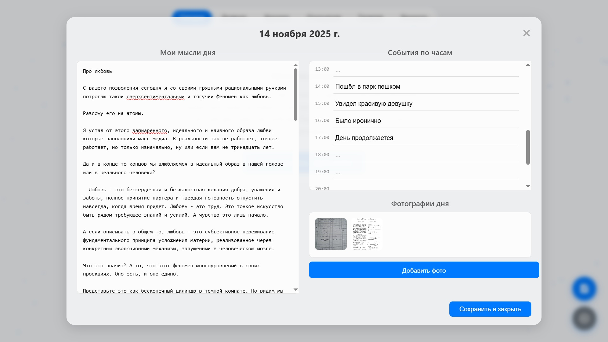

# Project Soul

> Ваша цифровая душа. Приватная. Вечная.

> "Человек со временем начинает забывать всё. Он постоянно меняется. И даже иногда может потерять свою душу."

**Project Soul** — это ответ на эту фундаментальную человеческую проблему. Это не просто дневник или архив. Это попытка создать целостный, зашифрованный и полностью автономный слепок вашего сознания — когнитивную модель, отражающую ваши мысли, воспоминания, ценности и связи.

Это ваш личный цифровой сейф для самого ценного — для вас самих.

---

---

## 🔮 Философия проекта

"Project Soul" стоит на четырех столпах, которые отличают его от любого другого существующего инструмента:

1.  **Абсолютный Суверенитет.** Ваши данные принадлежат только вам. Абсолютно.
    *   **100% Локально:** Приложение работает полностью в вашем браузере. Ни один байт вашей души никогда не покидает ваш компьютер.
    *   **Сквозное Шифрование:** Файл `.personality` зашифрован надежным алгоритмом AES-256 с ключом, который знаете только вы. Потеряли ключ — потеряли доступ. Навсегда. Мы не храним ничего.

2.  **Целостная Карта Личности.** Вы — это не просто набор заметок.
    *   "Project Soul" не разделяет вас на части. Он связывает ваши **мысли** из дневника, **события** из хроники, **связи** из графа отношений и **ответы** на глубокие вопросы в единую, многомерную модель.

3.  **Инструмент для Десятилетий.** Это не спринт, а марафон.
    *   Ценность этого проекта растет со временем. "Фильм жизни" в галерее, возможность оглянуться на свои мысли 10 лет назад, анализ своего пути — все это создано для долгосрочной рефлексии и роста.

4.  **Цифровое Бессмертие.** Ваше наследие — это не только то, что вы оставляете, но и то, кем вы были.
    *   Файл `.personality` — это самая честная капсула времени. В будущем, передав ключ доступа, вы можете оставить своим близким не просто воспоминания, а ответы. Возможность узнать вас настоящего.

## ✨ Ключевые Особенности

*   ✍️ **Интерактивный Дневник:** Записывайте мысли, события по часам и прикрепляйте фотографии к каждому дню вашей жизни.
*   🗓️ **Визуальная Хроника:** Путешествуйте по своей жизни через интерактивный календарь, где каждый год — это карта ваших воспоминаний, начиная с "нулевого" года.
*   🕸️ **Граф Отношений:** Уникальная визуализация вашей социальной вселенной. Карта ваших связей, их близость и тип, которая меняется вместе с вами.
*   🎬 **Галерея "Фильм Жизни":** Не просто смотрите фотографии. Проигрывайте их как фильм, читая свои мысли, записанные в тот самый день.
*   🧘 **Карта Личности:** Забудьте о сухих тестах. Отвечайте на глубокие, осмысленные вопросы, которые помогают структурировать вашу систему ценностей и философию.
*   🔒 **Формат `.personality`:** Единый, зашифрованный файл-контейнер для всей вашей души, который вы можете хранить где угодно.

## 🛠️ Технологии

Этот проект — гимн простоте и мощи "чистых" веб-технологий.

*   **HTML5, CSS3, JavaScript (ES6+)**
*   **Никаких фреймворков.** Ни React, ни Vue, ни Angular. Это обеспечивает максимальную легкость, скорость и долговечность.
*   **Никакого бэкенда.** Приложение на 100% клиентское.
*   **JSZip:** для создания файла-контейнера `.personality`.
*   **Web Crypto API:** для надежного шифрования прямо в браузере.
*   **SVG-Pan-Zoom:** для масштабирования и панорамирования Графа Отношений.

## 🚀 Как начать

Никаких установок, серверов и зависимостей.

1.  **Скачайте** репозиторий как ZIP-архив.
2.  **Распакуйте** его в любую папку на вашем компьютере.
3.  **Откройте** файл `index.html` в вашем любимом браузере (рекомендуется Chrome/Firefox).

Всё. Вы готовы создать или загрузить свою душу.

*   **Кастомизация:** Вы можете легко добавлять или изменять вопросы в панели "Личность", редактируя файл `questions.js`.

## 🛣️ Дорожная карта (Возможное будущее)

"Project Soul" — это живой организм. Вот некоторые идеи для его эволюции:

-   [ ] **Локальный ИИ-Ассистент:** Интеграция небольшой нейросети (работающей в браузере) для семантического поиска по вашим записям ("Найди все дни, когда я чувствовал себя счастливым, но одиноким") и анализа эмоциональных паттернов.
-   [ ] **Импорт Данных:** Возможность безопасно импортировать архивы из мессенджеров (Telegram) для обогащения вашей хроники.
-   [ ] **Динамический Граф Отношений:** Создание "снимков" графа в разные периоды времени и возможность проиграть анимацию его изменений.
-   [ ] **Мобильная версия (PWA):** Превращение сайта в Progressive Web App для удобной работы на мобильных устройствах.

## ❤️ Вклад

Этот проект — глубоко личное творение, но идеи и предложения всегда приветствуются. Если у вас есть мысли о том, как сделать "Project Soul" еще глубже и осмысленнее, не стесняйтесь открывать `Issues`.

## 📜 Лицензия

Проект распространяется под лицензией **MIT**. Это означает, что вы можете делать с ним всё, что захотите.

---

**Начните вести хронику своей души. Сегодня.**